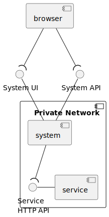
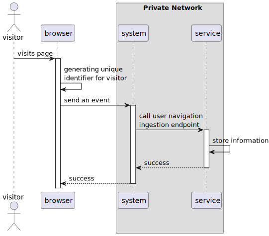
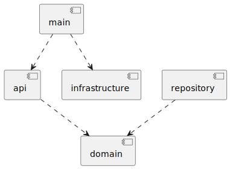

# Architecture

This document provides a small technical overview of the solution. Its intention is to ease the initial review of the
solution.

When documenting the solution's architecture I like to use the C4 model combined with the 4+1 model, using the UML
notation.

## Context

The following diagram represents the context where this service sits, according to my interpretation of the challenge.

Where:

- browser represents the location where the website is running and it sends "an event every time a visitor navigates to
  a page"
- system receives those events and talks "to a REST HTTP interface and represents each individual event as a JSON
  document"
- service is what will be developed this sprint
- service HTTP API is the API served by our service, containing the two endpoints described in the challenge
- system UI is an API that serves the frontend (html, js and css files)
- system API is the API served by the system and used by the browser to "send an event every time a visitor navigates to
  a page"
- a private network ensures that the "service HTTP API" is not exposed to the public

Based on this interpretation, there's no need to handle CORS or secure the service endpoints with TLS/SSL.

The basic process to track user navigation looks like the following:

## Service/Container

The server is organized into the following packages:

- api: responsible for validating requests before calling the repository and generating an http response;
- domain: responsible for defining the business concept and how data is managed within the server;
- repository: responsible for managing the data collected by the server;
- infrastructure: responsible for running the http server and defining generic wrappers like:
    - logging: logs basic request info;
    - content: set the content-type header on all responses to application/json;
    - recovery: ensures that if a panic occurs, a 500 is always returned;
- main.go: responsible for capturing flags passed to the program, registering the handlers and starting the server.

