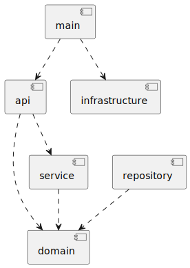

# Architecture

This document provides a small technical overview of the solution. Its intention is to ease the initial review of the
solution.

## Overview

The server is organized into the following packages:

- api: responsible for validating requests before calling the repository and generating an http response;
- domain: responsible for defining the business concept and how data is managed within the server;
- repository: responsible for managing the data collected by the server;
- infrastructure: responsible for running the http server and defining generic wrappers like:
    - logging: logs basic request info;
- main.go: responsible for capturing flags passed to the program, registering the handlers and starting the server.

